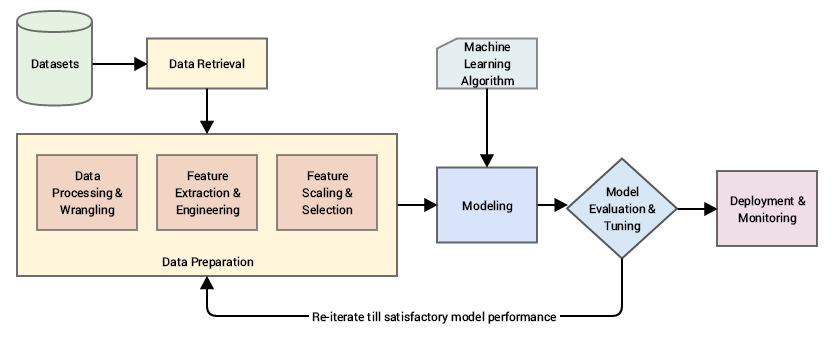

**What is Feature Engineering?**

Feature engineering involves selecting, creating, or transforming features from raw data to make it more suitable for machine learning models. Features, also called dimensions or input variables, are the elements that models use to learn patterns and make predictions. The quality and relevance of features directly impact model accuracy, efficiency, and generalizability.

